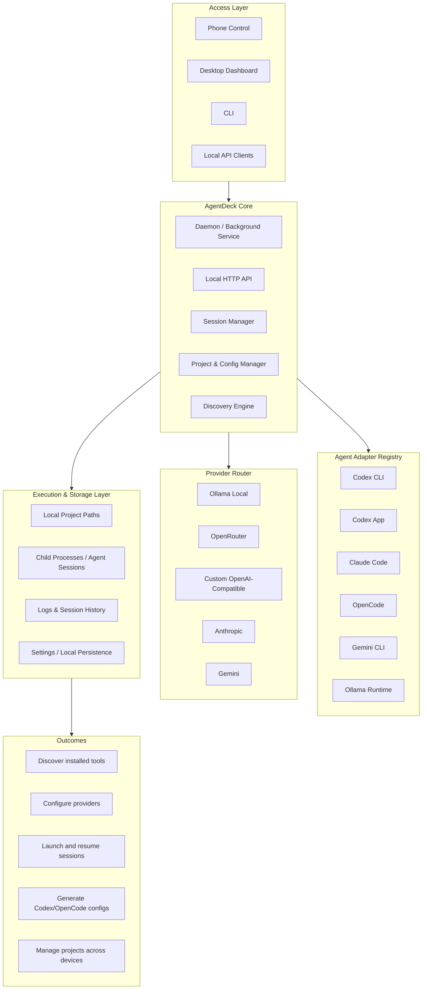

# AgentDeck

AgentDeck is a Windows-first agent cockpit for developer AI agents and model runtimes. It gives developers one local control layer for discovering installed tools, configuring OpenAI-compatible providers, registering projects, launching agent sessions, and reviewing logs.

AgentDeck is inspired by Ollama's architecture pattern: a simple CLI, a background daemon, a local HTTP API, provider/runtime management, OpenAI-compatible interfaces, and integrations with external tools. AgentDeck applies that pattern to **agent orchestration** instead of local model serving.

## Architecture Overview



AgentDeck is organized around six product layers:

1. **Access Layer** — CLI, Electron desktop app, local dashboard, and local HTTP clients all talk to the same daemon.
2. **AgentDeck Core** — daemon lifecycle, health reporting, provider registry, project registry, session registry, discovery engine, and integration config generation.
3. **Agent Adapter Registry** — structured metadata and discovery for Codex CLI, Codex App, Claude Code, OpenCode, Gemini CLI, and Ollama Runtime.
4. **Provider Router** — normalized provider definitions for Ollama Local, OpenRouter, custom OpenAI-compatible endpoints, and future Anthropic/Gemini integrations.
5. **Execution & Storage Layer** — validated project paths, shell-free launches for known adapters, stdout/stderr log capture, and JSON persistence in the OS app-data directory.
6. **Outcomes** — discover tools, configure providers, register projects, launch sessions, inspect logs, and generate safe integration configs from one cockpit.

The architecture diagram is stored as Mermaid text so PRs stay reviewable. Generated PNGs should not be committed. The same architecture is also available in the app on the **Architecture** dashboard page.

## Current MVP status

Implemented foundation:

- Local daemon at `http://127.0.0.1:3768` with `/health` and `/api/status`
- HTTP API for health/status, providers, provider tests, agents, projects, sessions, discovery refresh, and integrations
- Provider registry for Ollama, OpenRouter, custom OpenAI-compatible endpoints, plus Anthropic/Gemini placeholders
- Agent adapter registry for Codex CLI, Codex App, Claude Code, OpenCode, Gemini CLI, and Ollama Runtime
- PATH-based discovery using `where` on Windows and `which` on Unix-like systems
- JSON persistence in the AgentDeck data directory
- Session lifecycle with create/start/stop/restart, process ids where available, and stdout/stderr log capture
- OpenAI-compatible config generation for Codex and OpenCode with dry-run and backup behavior
- Dark dashboard with Home, Architecture, Providers, Agents, Projects, Sessions, Integrations, and Settings pages


## Windows Quickstart

1. Clone this repository.
2. Run `npm install`. Electron and `node-pty` are optional dependencies; if their native/binary downloads fail, npm continues and the daemon/process-mode MVP still works.
3. Run `npm run build`.
4. Start the daemon with `node dist/cli/index.js start`.
5. Open `http://127.0.0.1:3768`.
6. Add or verify the Ollama provider.
7. Register a project such as `C:\code\my-project` or `C:\Users\Name With Spaces\project`.
8. Create a session from the registered project. If PTY is unavailable, use process mode or allow AgentDeck to fall back.
9. Enable phone control from Settings or `node dist/cli/index.js remote enable`.
10. Pair your phone from the generated LAN URL while desktop and phone are on the same Wi-Fi/LAN.

## Install and build

```bash
npm install
npm run build
```

For local development:

```bash
npm run dev
```

## Start the daemon

```bash
npm run build:main
node dist/cli/index.js start
```

If installed as a package, use:

```bash
agentdeck start
```

The daemon serves the API and, after `npm run build`, the static dashboard.

## Open the dashboard

```bash
agentdeck open
```

or visit:

```text
http://127.0.0.1:3768
```

The Electron app also starts the local daemon when possible.

## CLI quickstart

```bash
agentdeck status
agentdeck discover
agentdeck providers list
agentdeck providers add --type ollama --name "Ollama Local" --baseUrl http://localhost:11434/v1 --model llama3.1
agentdeck provider add --type openrouter --name OpenRouter --baseUrl https://openrouter.ai/api/v1 --apiKeyEnvVar OPENROUTER_API_KEY --model openai/gpt-4o-mini
agentdeck providers test ollama
agentdeck projects list
agentdeck projects add C:\\code\\my-project
agentdeck sessions list
agentdeck sessions create --projectId <project-id> --agentId codex-cli --providerId ollama --model llama3.1
agentdeck sessions start <session-id>
agentdeck sessions stop <session-id>
```

## Dashboard overview

- **Home**: daemon status, detected tools, configured providers, recent sessions, projects, and quick links.
- **Architecture**: architecture image plus layer-by-layer explanation.
- **Agents**: adapter metadata, detected/not detected states, executable paths, and versions when available.
- **Providers**: provider list and add/update form.
- **Projects**: register local paths and see linked session counts.
- **Sessions**: create sessions, start/stop/restart known adapters, filter recent runs, and inspect logs.
- **Integrations**: generate Codex/OpenCode OpenAI-compatible config snippets with dry-run and backup behavior.
- **Settings**: local storage path, app info, export local config, and reset local data action.

## Environment variables

AgentDeck stores API key references as environment variable names. It does not store raw API keys.

Common provider variables:

- `OPENROUTER_API_KEY` for OpenRouter
- `OLLAMA_API_KEY` for tools that require an env var even when using local Ollama-compatible endpoints
- `CUSTOM_OPENAI_API_KEY` for custom OpenAI-compatible providers
- `ANTHROPIC_API_KEY` and `GEMINI_API_KEY` for future native integrations

Daemon settings:

- `AGENTDECK_HOST` defaults to `127.0.0.1`
- `AGENTDECK_PORT` defaults to `3768`
- `AGENTDECK_URL` can point the CLI at another local daemon URL
- `AGENTDECK_DATA_DIR` overrides the local data directory

## Data directory

AgentDeck persists `agentdeck.json` and session logs in:

- Windows: `%APPDATA%/AgentDeck`
- macOS: `~/Library/Application Support/AgentDeck`
- Linux: `~/.config/agentdeck`

## Configure integrations

Use the Integrations page or API endpoints:

- `POST /api/integrations/codex/configure`
- `POST /api/integrations/opencode/configure`

Dry run is the default. If `dryRun: false` is provided, AgentDeck creates a timestamped backup before writing the target config file.

## MVP limitations

- `agentdeck start` runs the daemon in the foreground. Windows service commands call `sc.exe` on Windows, require Administrator rights for install/uninstall, and return an unsupported message on other platforms.
- Provider model listing and connection tests are implemented for Ollama/OpenAI-compatible providers where the endpoint and environment variables are available; Anthropic/Gemini remain placeholders.
- Anthropic and Gemini are registered as placeholders for future native integrations.
- Session launch support is intentionally restricted to known adapters discovered in PATH. PTY support is optional; process-mode fallback remains available when `node-pty` is unavailable.

## More docs

- [Local development](docs/LOCAL_DEVELOPMENT.md)
- [Provider setup](docs/PROVIDER_SETUP.md)
- [Session engine](docs/SESSION_ENGINE.md)


## Live sessions

Create a live terminal session from the Sessions page or CLI:

```bash
agentdeck sessions create --projectId <project-id> --agentId codex-cli --providerId ollama --model llama3.1 --mode pty --start
```

The dashboard streams live output from `GET /api/sessions/:id/stream`, sends input through `POST /api/sessions/:id/input`, and keeps historical logs available through `GET /api/sessions/:id/logs`.

## Windows service and tray

Windows service commands are available from the CLI:

```powershell
agentdeck service install
agentdeck service start
agentdeck service status
agentdeck service stop
agentdeck service uninstall
```

The Electron app also includes a tray menu for opening AgentDeck, starting/stopping/restarting the daemon, opening data/log folders, and quitting.

## Phone Control (LAN MVP)

AgentDeck can now expose a phone-optimized `/phone` cockpit on your trusted LAN. Phone access is disabled by default; enable it from **Settings → Phone Control** or `agentdeck remote enable`, then pair with the generated one-time token. Paired phones can monitor status, projects, providers, agents, sessions, logs, and start/stop/restart existing sessions. See `docs/PHONE_CONTROL.md` and `docs/REMOTE_ACCESS_SECURITY.md`.
## Stabilization checks

The MVP is expected to pass:

```bash
npm install
npm run lint
npm test
npm run build
npm run smoke
```

`npm run smoke` starts a temporary daemon on a free port, verifies the static dashboard and `/phone` routes, exercises remote pairing, validates phone-safe auth, revokes the test device, and shuts the daemon down.
