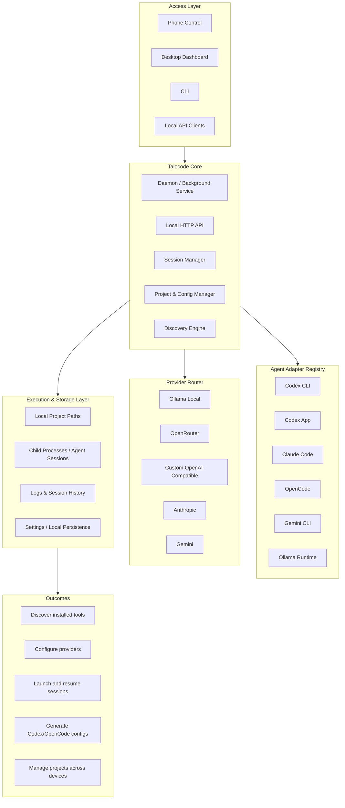

# Talocode Architecture

The architecture diagram is stored as Mermaid text so PRs stay reviewable. Generated PNGs should not be committed.

Talocode follows an Ollama-inspired local architecture for agent orchestration. The goal is to make one command start a local control plane that can discover tools, configure providers, register projects, launch sessions, capture logs, and expose the same capabilities through a dashboard and HTTP API.

## Layer 1: Access Layer

The access layer is intentionally simple:

- `talocode` CLI for daemon lifecycle, status, discovery, providers, projects, sessions, and dashboard opening.
- Electron desktop app for a Windows-first cockpit experience.
- Local dashboard served by the daemon after a production build.
- Local HTTP API for future integrations and external tooling.

All access paths converge on the same local daemon so behavior is consistent regardless of UI.

## Layer 2: Talocode Core

The core service owns product state and orchestration responsibilities:

- Daemon initialization and health reporting.
- Provider registry operations.
- Agent adapter listing and discovery coordination.
- Project registration with local path validation.
- Session registry and process lifecycle operations.
- OpenAI-compatible config generation for integrations.
- Local persistence coordination.

The core is separate from the HTTP server so a future Windows service wrapper can reuse it without duplicating business logic.

## Layer 3: Agent Adapter Registry

Adapters define how Talocode understands external tools. The current registry includes:

- Codex CLI
- Codex App
- Claude Code
- OpenCode
- Gemini CLI
- Ollama Runtime

Each adapter has an id, display name, executable candidates, supported platforms, docs URL, detection command, config locations, and launch argument template. Discovery checks PATH with `where` on Windows and `which` on Unix-like systems, then runs a version command when available.

## Layer 4: Provider Router

The provider router normalizes metadata for model/runtime providers:

- Ollama Local: `http://localhost:11434/v1`
- OpenRouter: `https://openrouter.ai/api/v1`
- Custom OpenAI-compatible endpoint
- Anthropic placeholder
- Gemini placeholder

Provider records store environment variable names such as `OPENROUTER_API_KEY`, not raw secret values.

## Layer 5: Execution & Storage Layer

Execution is deliberately constrained for safety:

- Only known adapters can be launched.
- Launches use `spawn` with `shell: false`.
- Project paths must exist and be directories.
- stdout/stderr streams are captured to per-session log files.
- Store and logs live in OS-appropriate app-data directories.
- External integration configs are backed up before writes.

## Layer 6: Outcomes

Talocode's architecture enables the user to:

- Discover installed agent tools.
- Configure local and hosted providers.
- Register projects.
- Create and launch sessions.
- Capture and review logs.
- Generate Codex/OpenCode OpenAI-compatible config snippets safely.

## Why this architecture

Agent orchestration needs a local control plane because agent tools, project paths, shells, logs, and model runtime credentials are machine-local concerns. The Ollama-style daemon/API/CLI pattern gives Talocode a small, predictable foundation that can later grow into a Windows service, tray app, richer PTY streaming, provider model sync, and optional team/cloud sync without replacing the local-first core.

## Current local API surface

The daemon exposes health/status, provider CRUD and tests, project CRUD, session lifecycle/logs, discovery cache/refresh, settings export/reset, and integration config preview/write endpoints. The HTTP layer delegates business logic to `TalocodeCore`, keeping the future Windows service path clear.

## Phone-to-desktop control layer

The daemon now includes an explicit remote-access layer. Localhost clients keep the regular dashboard/CLI flow, while LAN clients must pair through `/api/remote/pair` and then present a bearer token for protected APIs. The `/phone` route is a mobile-first UI that consumes safe daemon endpoints without exposing raw secrets or desktop-only destructive actions.

## Migration from AgentDeck

Talocode started as the AgentDeck prototype. The project has moved to the Talocode brand and repository at https://github.com/talocode/talocode.
