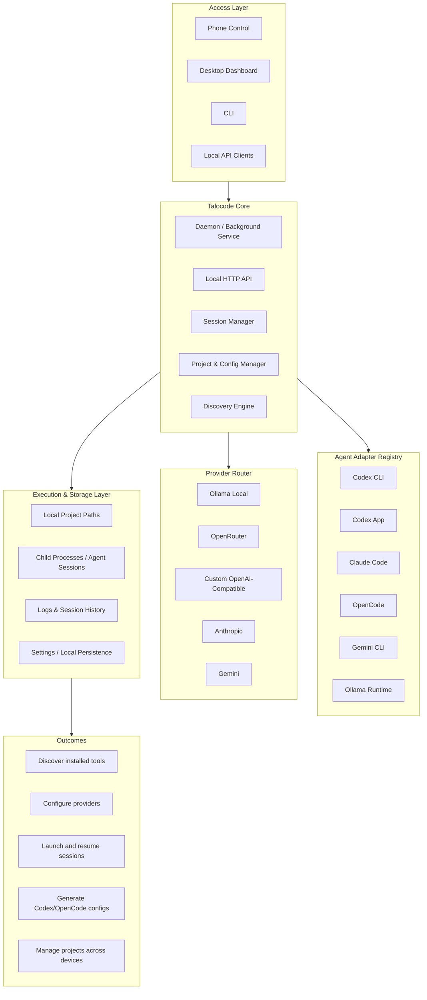

# MVP Scope

The MVP establishes Talocode as a local-first, Windows-first agent cockpit following the architecture in `docs/ARCHITECTURE.md`.

## Implemented now

- Architecture source stored as Mermaid text in `docs/talocode-architecture.mmd` and embedded in documentation so PRs remain reviewable.
- Local daemon and HTTP API.
- Provider metadata management for Ollama, OpenRouter, custom OpenAI-compatible endpoints, OpenAI, Anthropic placeholder, and Gemini placeholder.
- Agent adapter registry and PATH discovery.
- Project registration with path validation and optional notes.
- Session creation/start/stop/restart with log capture, optional PTY, process fallback, and SSE output streaming.
- JSON persistence in platform-native data directories.
- CLI commands for core workflows and remote access.
- Dashboard pages for Home, Architecture, Providers, Agents, Projects, Sessions, Integrations, and Settings.
- Codex/OpenCode OpenAI-compatible config generation with dry-run and backups.
- LAN-only Phone Control with one-time pairing token, hashed device access tokens, revocation, and mobile `/phone` UI.
- Windows service/tray foundations with graceful unsupported-platform/unavailable-tray behavior.

## Partial/fallback behavior

- PTY support depends on optional `node-pty`; process mode remains the reliable fallback.
- Electron is optional for install reliability; the daemon/browser workflow is the most reliable MVP path.
- Windows service commands use `sc.exe` directly and require Administrator rights for install/uninstall.
- Native QR image rendering is not included; QR payload/phone URL is displayed.

## Out of scope for MVP

- Signed Windows installer and full service recovery policy.
- Secure OS keychain storage.
- Cloud sync/team accounts/off-LAN relay.
- Full native Anthropic/Gemini session routing.
- Arbitrary command execution or arbitrary project path registration from phone clients.
- Direct raw secret storage or display.

## Stabilization acceptance

The MVP should pass `npm install`, `npm run lint`, `npm test`, `npm run build`, and `npm run smoke` before release handoff.

## Migration from AgentDeck

Talocode started as the AgentDeck prototype. The project has moved to the Talocode brand and repository at https://github.com/talocode/talocode.
